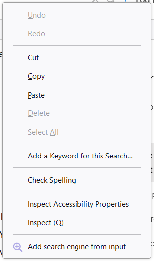

#  Custom Search Engine

*A Firefox extension for easily adding custom search engines*

  

---

This extension provides a couples of ways to easily add custom search engines to Firefox:
* Adds an icon in the search bar to launch a popup for entering information manually
    * Includes a button that attempts to autofill a URL from the page
* Adds a context menu item for opening a popup with an autofilled entry from a text input

Permissions requested on installation:
* Access your data for all websites: *In order to be able to automatically grab search URLs from a page, the extension
needs to inject a small amount of JavaScript on the tab. In other words, it needs to run a small amount of code on the
tab.*

---

Note that this extension needs to export a very small amount of data to be able to let you create custom search engines.

The exported data is as follows:
* The name you've provided for a custom search engine
* The description you've provided for a custom search engine
* The URL of the site you are creating a custom search engine for

This is sent to `https://paste.mozilla.org`, where it is stored for one hour. See PRIVACY-POLICY.md for more information.